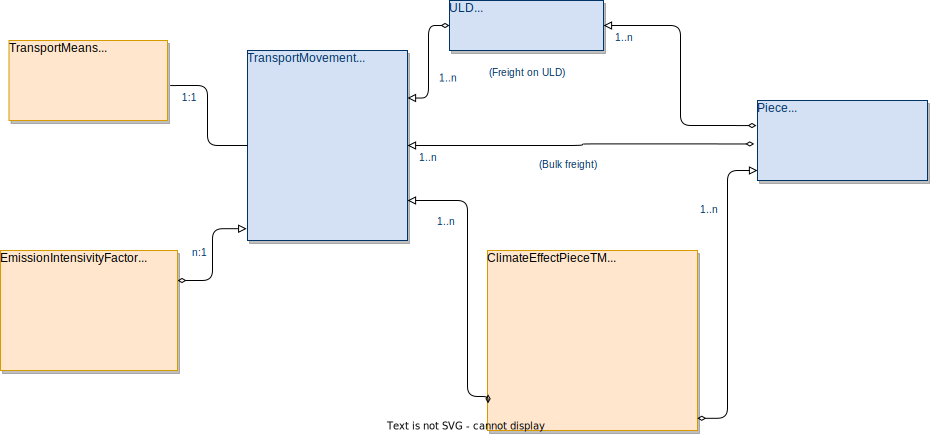

# Providing CO2 Transparency in ONE Record

- [Providing CO2 Transparency in ONE Record](#providing-co2-transparency-in-one-record)
  * [Basic Information on this document](#basic-information-on-this-document)
    + [Objective](#objective)
    + [Target audience](#target-audience)
    + [Geographical coverage](#geographical-coverage)
    + [Creators](#creators)
    + [Continous development and availability](#continous-development-and-availability)
    + [Use and reference](#use-and-reference)
    + [Publication date, version and history](#publication-date--version-and-history)
  * [Dependencies](#dependencies)
    + [Standards applied](#standards-applied)
    + [ONE Record Server Implementation used](#one-record-server-implementation-used)
    + [Other Software products used](#other-software-products-used)
  * [Assumptions](#assumptions)
  * [Solution approach](#solution-approach)
  * [Solution in current environment](#solution-in-current-environment)
- [Data use and target process](#data-use-and-target-process)
  * [transportMovement LO](#transportmovement-lo)
    + [Data fields: distanceMeasured and distanceCalculated](#data-fields--distancemeasured-and-distancecalculated)
    + [Data field: fuelType](#data-field--fueltype)
    + [Data fields: fuelAmountMeasured and fuelAmountCalculated](#data-fields--fuelamountmeasured-and-fuelamountcalculated)
    + [Data field: totalLoadedWeight](#data-field--totalloadedweight)
  * [payloadDistance LO](#payloaddistance-lo)
    + [Data field: payloadDistanceResult (value)](#data-field--payloaddistanceresult--value-)
    + [ISOTransparencyLevel (int)](#isotransparencylevel--int-)
    + [FuelConsumptionParameter](#fuelconsumptionparameter)
    + [DistanceParameter](#distanceparameter)
    + [CO2CoefficiencyFactor](#co2coefficiencyfactor)
    + [Other data fields](#other-data-fields)
  * [transportMeans LO](#transportmeans-lo)
    + [Data field: typicalFuelConsumption](#data-field--typicalfuelconsumption)
    + [Data field: typicalCO2Coefficient](#data-field--typicalco2coefficient)
    + [Data field:](#data-field-)
  * [piece LO](#piece-lo)
    + [Data field: grossWeight](#data-field--grossweight)
    + [Data field: skeletonBy](#data-field--skeletonby)
  * [ClimateEffect LO](#climateeffect-lo)
    + [Data field: CO2equivalentWTW](#data-field--co2equivalentwtw)
    + [Data field: CO2equivalentTTW](#data-field--co2equivalentttw)
    + [Data field: MethodName](#data-field--methodname)
    + [Data field: MethodVersion](#data-field--methodversion)
    + [Data field: MethodLink](#data-field--methodlink)
    + [Data field: Verification](#data-field--verification)
    + [Data field: Accreditation](#data-field--accreditation)
    + [Data field: TransportActivity](#data-field--transportactivity)
    + [Data field:  includedClimateEffects](#data-field---includedclimateeffects)
- [API use](#api-use)
    + [Technical setting](#technical-setting)
    + [Basic API-Features used](#basic-api-features-used)
  * [Results / Summary](#results---summary)
  * [Additional comments / FAQs](#additional-comments---faqs)
    + [How do we deal with missing piece information?](#how-do-we-deal-with-missing-piece-information-)
## Basic Information on this document

### Objective 
The purpose of this document is to provide a Good Practice for end2end and multi-modal CO2 emission transparency in the IATA ONE Record-based data eco-system.

### Target audience
This document can be used by any party with the interest of using digital accompanying documents in ONE Record. 

### Geographical coverage
As there are no legal or operational restrictions, the solution can be used world wide.

### Creators
This document is the outcome of a ONE Record pilot project with the "Digitales Testfeld Air Cargo" by the German air cargo community. Parties/Persons involved were:

Lufthansa Cargo, Philipp Billion

Souvereign, Heidi Han Yin Luu

Souvereign, Moritz Tölke

Fraunhofer IML, Oliver Ditz

Lufthansa Industry Solutions, Daniel Döppner

### Continous development and availability

This document is to be used and continously developed, even if the current major stakeholders should move to other topics. Thus a "handover" in Github is planned if responsibilities should shift.

### Use and reference

This Good Practice is free to access and use. If you use it, please refer to this document explicitly plus provide a link to the Github repository as source. This will ensure know-how-transfer and transparency.

### Publication date, version and history

Publication date, version and history should be provided by the Github version control system and not be duplicated here.

## Dependencies

### Standards applied

The ONE Record business ontology version as of APR 13, 2022 was used [Working draft Ontology of 2022APR13](https://github.com/IATA-Cargo/ONE-Record/blob/bbe86e364b04d6a6279f0ab6e9ee47e1905ec9c4/working_draft/ontology/IATA-1R-DM-Ontology.ttl).

The ONE Record API and security specification draft witout a version as of APR 13, 2022 was used (no link available yet).

### ONE Record Server Implementation used

(no ONE Record server implementation yet)

### Other Software products used

## Assumptions

One or more stakeholders are able to provide CO2 transparency on their segments of the transport, other stakeholders are interested and capable of consuming this data.

A central assumption is that there is an interest of stakeholders to recieve CO2 transparency on piece level, end2end, multi-modal.

## Solution approach

The ONE Record data model follows two principles: Piece-centricity and physics-orientation. Piece-centricity is self-explanatory, as every information is linked with the piece as the lowest available transportation object. Physics-orientation means that the linking strucutre of ONE Record follows the structures of the physical world (for more details, please refer to [ONE Record Github Repository](https://github.com/IATA-Cargo/ONE-Record).

The problem here is that the two principles are "collading" by some aspects here: The CO2-Emissions happen to the ***TransportMeans*** as trucks and planes burn fuel, not pieces or shipments. On the other hand, it would not help a data consumer to know that the aircraft with it´s piece onboard burnt a specific ammount of fuel without a brakedown to it´s piece. To close this gap, a set of data objects and process descriptions is described here to enable end-to-end, multi-modal CO2 tracking throughout the supply chain.

The vision of this approach is to give even to consumers a transparency on CO2 emissions potentially from the production site to his door, covering all movement of the piece.

Principally, the approach does not define a CO2-Emission calculation methode, but supports any methode, and even the option of providing results for different calculation methods. It also enables transparency on the calculation parameters (fuel burnt, distances, etc.), their acquisition methode (measured, calculated), so a data consumer could potentially apply his own calculation method.

## Solution in current environment

In the legacy messaging environment, end to end CO2 emission tracking on piece level isn´t possible. Generic solutions for transparency on shipment level are in place, but don´t follow a standardized approach for different modes of transportation.

# Data use and target process

Climate relevant emissions are performed by a ***transportMeans*** on a ***transportMovement***, because a ***transportMeans*** does not produce emissions by itself (e.g. a plane that isn´t flying), the primary attribution of CO2-Emissions is linked with the ***transportMovement***. The ***transportMovement*** can be any movement of pieces, like a Truck leg, a flight, or even a forklift-movement. 

While all climate data exchange around ***transportMeans*** and ***transportMovement*** serves for submitting the data basis for climate impact calculation between different stakeholders of the supply chain, the following climate impact data on piece level serves to fulfill the estimation of the actual impact of the transport on the climate.

|   	|Physical object with climate impacting emissions|Climate impacting attributions on piece level|
|---	|---	|---	|
|Focus LOs  	|***transportMeans***, ***TransportMovement***, ***payloadDistance***|***piece***, ***climateEffect***|
|Example|RFS Truck from AMS to CDG caused 12t  
|Purpose|Provide basic data for climate impact calculation on piece level|Provide transparency on climate impact of transport on piece level|
|Provider of data	|Operators (Airline, Trucking Company, etc.)|"Supply chain orchestrators" (can be airlines, forwarders, booking platforms)|
|Target Group / Data consumers |"Supply chain orchestrators" (can be airlines, forwarders, booking platforms)|Shippers, end customers, etc.|

The following diagram shows the relevant data fields in the ONE Record data model:

 

## transportMovement LO

The TransportMovement directly contains emission-relevant data: The ***distanceMeasured***, the ***distanceCalculated***, the ***fuelType***, the ***fuelAmountMeasured***, the ***fuelAmountCalculated*** and a link towards the correlating CO2-Emissions ***CO2Emissions*** (1:n link).

### Data fields: distanceMeasured and distanceCalculated

If available, the actually measured distance is provided in the ***distanceMeasured*** data field. Only if not available, the ***distanceCalculated*** data field should be populated.

### Data field: fuelType

The ***fuelType*** data field should indicate the fuel that was consumed for this ***transportMovement***. "Kerosene", "SAF", "Renewable electric energy" are examples for possible values ***no standardized list, list by ISO expected; Moritz: standard-liste Referenz***. 
1:n
***Energy Carrier***
***FeedStock***
***FeedStockShare***
Data exchange guidance Table 6 (Mail vom 29.4.2022)

### Data fields: fuelAmountMeasured and fuelAmountCalculated

If available, the actually measured fuel consumption is provided in the ***fuelAmountMeasured*** data field. Only if not available, the ***fuelAmountCalculated*** data field should be populated.

### Data field: totalLoadedWeight

TBD: the total transportation weight is required for climate relevant emission monitoring. Question: How do we deal with this? 

Option 1: Assume shipments are not split, so it is the sum of all totalGrossWeighs of the Shipments. Pro: Realistic and exact, con: doesn´t work if shipments are split

Option 2: Sum the pieces on truck. Pro: easy to calculate; con: is not correct (total gross weight is usually higher with additional loading equipment), Piece info often missing

Option 3: create a new measured value totalLoadedWeight; most accurate, but also available?

## payloadDistance LO

The ***payloadDistance*** LO describes the relevant factor for the climateImpact calculation on a truck.

### Data field: payloadDistanceResult (value)

The payloadDistanceResult is a most relevant parameter for the estimation of the climate impact of this transportMovement. It is usually calculated by multiplying the weight and the distance of the transportMovement. Possible units are kilogram-kilometre ("kgkm"), tonne-kilometre ("tkm"), kilometre-tonne ("kmt") and "ton-mile", which is in the US: 1 ton-mile * ( 0.907185 t / short ton) * ( 1.609344 km / mile ) = 1.460 tkm.

### ISOTransparencyLevel (int)

This parameter shows the level of parameters to be included. 

TBD here, e.g. is there a level including the deadhead legs? Etc.

### FuelConsumptionParameter

This indicator can be either "measured" or "calculated". It describes the calculation basis for the calculation result, and not the data basis, which can be found in the the ***fuelAmountMeasured*** and ***fuelAmountCalculated*** of the transportMovement (TBD: Obsolete due to the ISO Levels bringing clear indicators here?).

### DistanceParameter

This indicator can be either "measured" or "calculated". It describes the calculation basis for the calculation result, and not the data basis, which can be found in the the ***distanceMeasured*** and ***distanceCalculated*** of the transportMovement (TBD: Obsolete due to the ISO Levels bringing clear indicators here?)

### CO2CoefficiencyFactor

**tbd** required?

### Other data fields

Other data fields like ***departureLocation*** and ***arrivalLocation*** could be used to verify the CO2-Emission relevant data sources. Additionally, relevant information could be added as an ***externalReference***, if only available as PDF. This could also be used for an image or a GPS-track of the geo-locational movement to provide an additional layer of information.

The ***movementType*** has a special relevance here, as it indicates wether this is a planned transport movement or an already  performed one.

## transportMeans LO

The ***transportMeans*** describes the means of transportation used to perfom for the linked transportMovement. Classical examples are a truck that performs a road leg for a transportation from the forwarder´s hub to the carrier´s origin airport, or a Boeing 777 freighter to perform a flight from Frankfurt to Rio de Janeiro. 

### Data field: typicalFuelConsumption

The ***typicalFuelConsumption*** describes an average amount of fuel for a defined distance, e.g. 12 l / 100 km. This does not include the type of fuel, as one of the assumptions is that the consumption doesn´t depend on the type of fuel. When using this, the ***unit*** data field is quite extensively used, with a content like "l/100km".

### Data field: typicalCO2Coefficient

The ***typicalCO2Coefficient*** describes ??? required?

### Data field: 

## piece LO

The Piece is the central unit of the ONE Record data model, and thus climate impact should be calculated and published on this level. If no detailed piece information is available, the total gross weight of the shipment is evenly distributed amoungst the pieces of the shipment. The total number of pieces should also be known. If the weights of individual pieces are known, they must be taken into account.

### Data field: grossWeight

The data field ***grossWeight*** within the piece LO describes the weight of the piece, and thus is to be used for the impact calculation

### Data field: skeletonBy

The data field ***skeletonBy*** aims for providing information, if and by whom a piece skeleton was created. Skeleton pieces are placeholders, if the owning party does not provide piece information (usually the Shipper). In that case, the totalGrossWeight of the shipment is evently distributed over the number of pieces, and thus pieces skeletons are created with a generic UPID. If the field is filled with content, piece skeletons were created, if left blank, piece information is available. Piece skeletons can be created by any party. Once piece skeletons are used, they are to be used along the supply chain for any piece-level purpose, instead of creating new piece skeletons by downflow parties.

## ClimateEffect LO

The ***climateEffect*** LO is the Logistics Object documenting the effective climate impact of the transportation of the piece. Each stakeholder should quantify the effect for his own part of the transportation chain, meaning the carrier should provide information for all legs under the MAWB contract, including flight legs, RFS, etc., the forwarder should provide all transportation legs under his control (usually the HAWB), including the carriers legs, etc. To clearly indicate these "embedded" emissions, a climateEffect can contain "embedded" climateEffects.

### Data field: CO2equivalentWTW

**tbd**

### Data field: CO2equivalentTTW

**tbd**

### Data field: MethodName

This field contains the name of the method applied.

### Data field: MethodVersion

This field contains the version of the method calculation, if available.

### Data field: MethodLink

This data field contains a URL to more details on the calculation method applied.

### Data field: Verification

**tbd**

### Data field: Accreditation

**tbd**

### Data field: TransportActivity

### Data field:  includedClimateEffects

This data field contains linked climateEffect calculation of embedded transport activites (see remarks above) 

# API use

### Technical setting

### Basic API-Features used

## Results / Summary

## Additional comments / FAQs

### How do we deal with missing piece information?

Principally, the ONE Record data model is based on the piece. Thus the ***climateImpact*** LO is linked to the piece, never the shipment. Thus we seem to have a problem, if e.g. the weights of each piece are missing, as this is a relevant factor for climate Impact calculation. 

But even if *detailed* piece information are not available, the number of pieces is usually available. In that case, the ***totalGrossWeight*** of the shipment is divided over the number of pieces. Meaning that it is assumed that all pieces have the same weight. This procedure is called the "use of piece skeletons". But this approach is only to be applied, if there´s no piece information available. If piece information are available, they must be taken into account for the climate impact calculation.

If a consumer wants to consume the ***climateImpact*** on shipment level, it is required to sum up the ***climateImpact*** of all pieces within the shipment. Providing the climate impact on shipment level is not possible within ONE Record.
