# Providing CO2 Transparency in ONE Record for 2023 ONE Record Hackathon hosted by LH Cargo

## Basic Information on this document

### Objective 
The purpose of this document is to provide a Guideline for end2end and multi-modal Greenhouse Gas emission transparency in the IATA ONE Record-based data eco-system for the 2023 ONE Record Hackathon hosted by LH Cargo. This document is supposed to suggest a first implementation guide for closing the bridge between the "Greenhouse Gas Logistics Emissions Data Model" of the Smart Freight Center and ONE Record. At a later stage, this draft approach is to be replaced by an aligned industry approach.

### Target audience
This document can be used by any party with the interest of using digital accompanying documents in ONE Record. 

### Geographical coverage
As there are no legal or operational restrictions, the solution can be used world wide.

### Creators
This document is the outcome of a ONE Record pilot project with the "Digitales Testfeld Air Cargo" by the German air cargo community. Parties/Persons involved were:

Lufthansa Cargo, Dr. Philipp Billion

Souvereign, Moritz Tölke

Frankfurt University of Applied Sciences, Niclas Scheiber

Fraunhofer IML, Oliver Ditz

Lufthansa Industry Solutions, Daniel Döppner

### Continous development and availability

As this is only a document to "close the gap", until a systematic and aligned integration by CO2-experts is available, this should not be the basis for long-term handling of this topic.

### Use and reference

This Good Practice is free to access and use. If you use it, please refer to this document explicitly plus provide a link to the Github repository as source. This will ensure know-how-transfer and transparency.

### Publication date, version and history

Publication date, version and history should be provided by the Github version control system and not be duplicated here.

## Dependencies

### Standards applied

The ONE Record business ontology version 3.0 as of APR 13, 2022 was used.

The ONE Record API and security specification draft of version 2.0 as of JUNE 15th, 2023 (https://ddoeppner.github.io/ONE-Record/).

The data fields and basic architecture of the data model are based on the "Data exchange of GHG Logistics Emissions - Guidance" by SmartFreightCenter, as of MARCH 2023.

## Assumptions

One or more stakeholders are able to provide greenhouse gas emission transparency on their segments of the transport, other stakeholders are interested and capable of consuming this data. A central assumption is that there is an interest of stakeholders to recieve CO2 transparency on piece level, end2end, multi-modal.

## Solution approach

Following the principleas of the SmartFreightCenter-approach, an integration draft was created, but with some limitations: According to the piece-centricity approach of ONE Record, climate effects are to be provided on piece-level. That is a narrowed down approach to the SmartFreightCenter-approach, where emissions can also be provided on shipment level.

The following diagram shows the correlation between the existing and the new data for climate impact transparency in ONE Record:

## Solution in legacy environment

In the legacy messaging environment, end to end CO2 emission tracking on piece level isn´t possible. Generic solutions for transparency on shipment level are in place, but don´t follow a standardized approach for different modes of transportation.

## GLEC Data Model and ONE Record Data Model Terminology

To avoid a new, unaligned approach to CO2-measurement, the GLEC Data Model is the basis for GHG-emission transparency in ONE Record. The terminology of the GLEC Framework and ONE Record is quite similar, but not completely identical. Differences in the terminology are minor enough to be accepted. In the following good practice, the terms will be used according to the ONE Record definition, but with remarks to identify significant differences.

### "Shipment"

GLEC Terminology: A shipment is an identifiable collection of one or more freight items to be transported together from the original shipper to the ultimate consignee. A shipment may be transported in one or a multiple number of consignments. A shipment can be aggregated or disaggregated to different consignments according to the requirements of the means of transportation on any one element of the transport chain, e.g., single bulk units and packages can be aggregated on a pallet and such pallet can be handed over as a unit for aggregation in a container, which in turn is treated as a consignment in a vehicle.

ONE Record: A shipment is physical freight by a shipper transported under one contract by a carrier, so this definition does not fit here. Instead, this definition fits best with the piece-definition of ONE Record and it's ability to reflect the physical world with the piece-in-piece-concept. But there is one limitation: Pure loading devices like containers or pallets are usually defined as LoadingUnits in ONE Record.

Conclusion: A "shipment": in the GLEC Terminology is either a single piece in ONE Record or a single piece plus a loadingUnit. 

### "Consignment"

GLEC Terminology: A consignment separately identifiable amount of freight transported from one consignor to one consignee via one or more modes of transport.

ONE Record: No use of the term "consignment", the definition indicates a use like the ONE Record term "shipment".

Conclusion: A consignment in the GLEC terminology can be matched with a shipment in ONE Record, either a master AWB (if concluded between a forwarder and a carrier), or a house AWB (if concluded between a shipper and a forwarder).

### "Transport chain element (TCE)"

GLEC Terminology: A transport chain element (TCE) is a section of a transport chain within which the freight is carried by a single vehicle or transits through a single hub.

ONE Record: No use of term "Transport chain element (TCE)", but the same function is covered by the "TransportMovement LO", with the limtation to a single leg. But as a transportMovement LO is always a single leg, there is no "transit through a single hub" in ONE Record like in the GLEC Terminology.

Conclusion: Same terminological approach, but the granularity is higher in the ONE Record use of the "TransportMovement LO". This should not lead to significant problems, as data on a higher granularity can be aggregated. 

### "Transport operation category (TOC)"

GLEC Terminology: A transport operation category (TOC) is a group of transport operations that share similar characteristics.

ONE Record: ONE Record uses activities, and subsets of activities can be clustered according to their characteristics.

Conclusion: Transport operations can be matched without problems with a variety of transport related Activities in ONE Record.  

### "Hub operation category (HOC)"

GLEC Terminology: A hub operation category (HOC) is a group of hub operations that share similar characteristics.

ONE Record: ONE Record uses activities, and a subset of those activities are performed in the hub. There is no clustering into "hub operations" so far.

Conclusion: Hub operation can be matched without problems with hub related Activities in ONE Record.

# Data use and target process

In ONE Record, climate relevant emissions are performed within the framework of ***activities*** , because an aircraft, a truck or a forklift do not produce emissions by themselfes (e.g. a plane that isn´t flying), thus the primary attribution of CO2-Emissions is linked with the ***activity***. Principally, any movement of pieces, like a Truck leg, a flight, or even a forklift-movement can be an activity, but also summarized activities like "warehousing" or "checks" can be used here to share GHG Emission data.

While all climate data exchange around ***activities*** serves for submitting the data basis for climate impact calculation between different stakeholders of the supply chain, the end user relevant climate impact data on piece level aims to fulfill the estimation of the actual impact of the transport on the climate for the shipper of the piece. While a linking of any activity in ONE Record with the parameters of co2 emissions is possible, our example only shows the implementation for the ***transportMovement***.

Important hint: The definitions of the additional, CO2 emission-related data fields, can be found in the "Data exchange of GHG Logistics Emissions - Guidance" by SmartFreightCenter, as of MARCH 2023 and will not be repeated here.

## transportMovement 

The TransportMovement directly contains emission-relevant data like ***distanceMeasured***, ***distanceCalculated***,  ***loadFactor***, ***loadFactorRemarks***, an indicator for "empty" flights ***positioningFlight*** and links towards the data objects ***ClimateEffect***, ***toc***, and ***EnergyFeedstock***.

## transportMeans

The ***transportMeans*** describes the means of transportation used to perfom for the linked transportMovement. Classical examples are a truck that performs a road leg for a transportation from the forwarder´s hub to the carrier´s origin airport, or a Boeing 777 freighter to perform a flight from Frankfurt to Rio de Janeiro. For road transport, the ***emissionClass*** is specifically relevant.

## energyFeedstock

The Energy feedstock reflects the energy used to perform the transportMovement. As this is in a 1:n relationship with the transportMovement, it can reflect shares like 30% kerosene and 70% SAF.

## toc

The toc ("Transport Operation Category") reflects the parameters for the climate effect calculation as described in the "Data exchange of GHG Logistics Emissions - Guidance" by SmartFreightCenter.  

## piece

The Piece is the central unit of the ONE Record data model, and thus climate impact should be calculated and published on this level. If no detailed piece information is available, the total gross weight of the shipment is evenly distributed amoungst the pieces of the shipment. The total number of pieces should also be known. If the weights of individual pieces are known, they must be taken into account.

## climateEffect

The ***climateEffect*** is the object documenting the effective climate impact of the transportation of the piece. Each stakeholder should quantify the effect for his own part of the transportation chain, meaning the carrier should provide information for all legs under the MAWB contract, including flight legs, RFS, etc., the forwarder should provide all transportation legs under his control (usually the HAWB), including the carriers legs, etc. 

# API use

No specific requirements here.

# FAQ

## How do we deal with missing piece information?

Principally, the ONE Record data model is based on the piece. Thus the ***climateImpact*** LO is linked to the piece, never the shipment. Thus we seem to have a problem, if e.g. the weights of each piece are missing, as this is a relevant factor for climate Impact calculation. 

But even if *detailed* piece information are not available, the number of pieces is usually available. In that case, the ***totalGrossWeight*** of the shipment is divided over the number of pieces. Meaning that it is assumed that all pieces have the same weight. This procedure is called the "use of piece skeletons". But this approach is only to be applied, if there´s no piece information available. If piece information are available, they must be taken into account for the climate impact calculation.

If a consumer wants to consume the ***climateImpact*** on shipment level, it is required to sum up the ***climateImpact*** of all pieces within the shipment. Providing the climate impact on shipment level is not possible within ONE Record.
